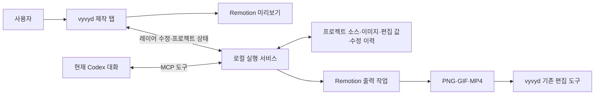

# vyvyd 홍보물·모션 제작 기능 구현 계획

작성일: 2026-10-02  
상태: 3단계 로컬 구현·검증 완료·사용자 검토 대기 · 4단계 대기 · HTTPS 연결 추가 확인

## 1. 만들려는 기능

**vyvyd 안에서 홍보물을 만들고 직접 편집하며, AI가 필요한 작업은 현재 Codex 대화에서 처리한다.**

사용자는 vyvyd에서 새 프로젝트를 만들고 이미지·로고를 넣는다. 현재 Codex에 제작을 요청하면 Codex가 그 프로젝트의 Remotion 코드를 작성한다. 결과는 vyvyd 안에서 재생되고, 사용자는 레이어를 이동하거나 문구·이미지를 수정한다. Codex는 이 수정 상태를 읽고 후속 작업을 이어간다. 완성한 작업은 PNG·GIF·MP4로 출력한다.

`ad-mage`는 Codex가 Remotion 코드로 제작하던 작업 방식만 참고한다. 기존 디자인, 템플릿, 홍보 문구나 이미지를 가져오는 단계는 없다. 새 프로젝트는 빈 캔버스와 실행에 필요한 최소 코드로 시작한다.

## 2. 진행과 검토 방식

- 아래 단계를 순서대로 진행한다. 각 단계가 끝나면 다음 단계로 넘어가기 전에 사용자 검토를 받는다.
- 검토할 때 실행 주소, 확인할 동작, 화면 또는 출력 파일, 검증 결과를 함께 제시한다.
- 사용자가 수정 요청을 하면 해당 단계에서 반영하고 다시 확인한다.
- 이 문서의 단계 상태와 결정 사항을 갱신해 진행 상황을 남긴다.
- 단계별 결과는 이 계획과 별도 검증 기록에 남긴다. Codex MCP 연결 설정은 2단계에서 수행한다.

| 단계 | 결과물 | 사용자가 확인할 핵심 | 상태 |
| --- | --- | --- | --- |
| 0 | Remotion 실행 방식 검증 | 코드 수정 → vyvyd 미리보기 → 실제 출력 | 로컬 완료 · HTTPS 추가 확인 |
| 1 | 제작 탭과 프로젝트 기반 | 빈 프로젝트 생성, 이미지 추가, 다시 열기 | 검토 완료 · 2단계 진행 승인 |
| 2 | 현재 Codex와 프로젝트 연결 | 대화에서 제작 요청 → 브라우저에 반영 | 검토 완료 · 3단계 진행 승인 |
| 3 | 레이어 직접 편집 | 이동·문구·이미지 수정, Codex와 상태 공유 | 로컬 완료 · 사용자 검토 대기 |
| 4 | 수정 이력과 연결 복구 | 동시 수정, Undo/Redo, 재연결 시 작업 보존 | 대기 |
| 5 | 저장·출력 완성 | PNG·GIF·MP4, 진행·취소, 기존 도구로 전달 | 대기 |
| 6 | 전체 흐름과 배포 환경 검증 | 처음부터 완성까지, 배포 주소에서 연결 | 대기 |

## 3. 권장 구조

화면은 기존 vyvyd의 새 **포스터 메이커 탭**으로 제공한다. 프로젝트 파일 관리, Codex 연결, Remotion 출력은 같은 저장소 안에 만드는 로컬 실행 서비스가 담당한다. 별도 편집기 사이트를 만드는 구조가 아니다.



vyvyd는 React 18.3·Vite 5 기반 앱이다. 1단계에서 로컬 프로젝트 저장소와 실행 서비스를 추가했고, 2단계에서 현재 Codex의 MCP 연결을 구현했다. 기존 영상 변환·이미지 편집의 작업 유지 구조를 활용하며, 제작 탭은 넓은 작업 공간을 제공하고 필요한 시점에 실행 모듈을 불러온다.

### 실행 방식은 0단계에서 확정

- 미리보기는 Remotion Player를 기본으로 검토한다. 새로운 소스 코드를 어떻게 컴파일하고 갱신할지는 작은 실행 검증으로 확정한다.
- 공식 브라우저 번들러와 Canvas 편집 기능도 후보에 넣는다. 두 API는 실험 단계이므로 현재 React·Vite 환경에서의 호환성과 코드 갱신을 먼저 확인한다.
- 브라우저 번들러가 적합하지 않으면 로컬 서비스에서 코드를 컴파일하고 vyvyd 안의 미리보기 영역에서 실행한다.
- 첫 버전의 출력은 로컬 Remotion 렌더러를 우선 검토한다. 미리보기와 출력은 같은 소스·편집 값·이미지·폰트를 사용한다.
- Remotion 관련 패키지는 같은 버전으로 고정한다. `ad-mage`의 React 버전을 복사하지 않고 실제 호환성 검증 결과로 결정한다.

브라우저 번들러는 소스 스냅샷을 컴파일할 수 있지만 저장·편집 UI·출력까지 제공하지는 않는다. 실행하는 프로젝트 코드는 호스트 권한으로 동작하므로, 다른 도구의 상태와 실행 경계를 함께 검토한다. [공식 브라우저 번들러 문서](https://www.remotion.dev/docs/browser-bundler)

## 4. 프로젝트와 레이어 규칙

프로젝트에는 다음 항목을 함께 저장한다.

| 항목 | 내용 |
| --- | --- |
| 프로젝트 정보 | ID, 이름, 문서 버전, 현재 수정 번호 |
| 구성 정보 | composition ID, 가로·세로, FPS, 전체 프레임 수 |
| Remotion 소스 | Codex가 작성한 TSX·CSS와 진입 파일 |
| 파일 | 업로드한 이미지·로고·폰트와 안정적인 asset ID |
| 직접 편집 값 | 레이어 ID별 위치·문구·이미지·스타일 등 |
| 수정 이력 | 정상 버전, 미적용 초안, 되돌리기에 필요한 변경 정보 |

로컬 서비스의 프로젝트 저장소를 연결 상태의 기준으로 사용한다. 이미지 파일은 프로젝트에 복사해 보관하고 임시 브라우저 URL에만 의존하지 않는다.

### 자유로운 Remotion 코드와 직접 편집을 연결하는 방법

Codex는 자유롭게 디자인과 애니메이션을 작성하되, 사용자가 편집할 요소는 안정적인 ID와 지원 속성을 가진 레이어로 등록한다. 이 등록 규칙은 디자인 템플릿이 아니라 편집기와 코드 사이의 공통 인터페이스다.

```text
편집 가능한 레이어: title, logo, product-image 등
  ├─ 코드의 기본 위치·문구·스타일
  ├─ 사용자가 변경한 편집 값
  └─ 내부의 Remotion 디자인·애니메이션
```

- 브라우저는 레이어의 편집 값을 수정한다. 드래그할 때 JSX를 직접 다시 작성하는 방식은 기본 경로로 사용하지 않는다.
- Codex는 소스와 사용자의 편집 값을 함께 읽는다. 특정 값을 바꾸라는 요청을 받으면 필요한 소스와 편집 값을 함께 갱신한다.
- 수동 위치 조정과 애니메이션 변형을 합성하는 규칙을 정해, 이동 후에도 원래 애니메이션을 유지한다.
- 레이어별로 수정 가능한 속성을 선언한다. 임의 JSX, 계산된 속성, 복잡한 SVG 내부 요소가 모두 자동으로 드래그 가능한 것은 아니다.
- 코드 변경 후에도 같은 요소의 ID를 유지한다. 레이어 삭제·교체로 남은 편집 값은 명시적으로 정리하거나 새 레이어에 연결한다.
- 순서 변경은 우선 같은 그룹 안의 등록 레이어를 대상으로 한다. 복잡한 중첩 구조 변경은 Codex 수정으로 처리한다.

공식 Canvas도 등록된 속성을 기반으로 편집하며, 계산된 위치는 직접 이동이 제한된다. 해당 API를 사용할지는 0단계에서 확인한다. [공식 Canvas 문서](https://www.remotion.dev/docs/canvas/canvas)

## 5. 단계별 작업

### 0단계 — 실제 실행이 가능한지 검증

작업:

- vyvyd 안의 최소 미리보기 영역에서 새 Remotion 코드를 실행한다.
- 한글 문구, 로컬 이미지, 폰트, 간단한 이동·회전 애니메이션을 확인한다.
- 소스를 수정했을 때 미리보기가 갱신되는지 확인한다.
- 편집 가능한 레이어 하나를 등록하고, 사용자가 변경한 위치·문구가 미리보기와 출력에 동일하게 반영되는지 확인한다.
- 브라우저 번들러·Canvas와 로컬 컴파일 방식 중 사용할 경로를 결정한다.
- PNG와 짧은 MP4를 실제 출력하고 미리보기와 비교한다.
- React 호환성, Vite 빌드, COOP/COEP와 이미지 로딩, 필요한 실행 도구 및 라이선스 조건을 확인한다.
- 배포된 HTTPS 화면과 로컬 서비스 사이의 기본 연결·미리보기·이미지 로딩 가능 여부를 작게 검증한다. 전체 배포 흐름은 6단계에서 검증한다.

검토 자료: 실행 화면, 코드 변경 전후, PNG·MP4 파일, 선택한 실행 방식과 이유.

완료 기준: 새 코드가 vyvyd에서 실행되고 출력까지 이어진다. 잘못된 코드의 오류를 보여주며 마지막 정상 화면을 유지한다.

검증 기록: [0단계 결과](./remotion-studio-stage-0.md). React 18 기반 로컬 미리보기·브라우저 TSX 컴파일·오류 복구·편집 값·PNG/MP4 출력 확인. 첫 구현은 로컬 vyvyd와 로컬 실행 서비스를 기준으로 한다. 배포된 HTTPS 화면에서의 로컬 연결은 성공 확인 전이며 6단계까지 추가 검증한다.

### 1단계 — 제작 탭과 프로젝트 기반

작업:

- 새 제작 탭에 프로젝트 이름·캔버스·파일 목록·연결 상태를 배치한다.
- 빈 프로젝트 생성, 크기·FPS·길이 설정, 이미지 업로드를 만든다.
- 프로젝트 문서, 소스, 파일, 레이어 편집 값의 저장 형식을 정의한다.
- 저장·다시 열기와 안정적인 파일 경로를 구현한다.
- 탭 이동 후 프로젝트와 현재 프레임을 유지하고 숨겨진 미리보기의 재생을 멈춘다.

검토 자료: 빈 프로젝트 생성 → 이미지 추가 → 새로고침 및 서비스 재시작 → 다시 열기 시연.

완료 기준: 같은 프로젝트와 이미지가 복원되고 기존 도구의 입력·설정·작업도 유지된다.

검증 기록: [1단계 결과](./remotion-studio-stage-1.md). 빈 프로젝트·파일 보관·명시 저장·서비스 재시작 후 복원·프레임 유지·저장 실패 시 입력 보존 확인. 기능 이름은 사용자 선택에 따라 **포스터 메이커**로 확정했다. 사용자의 검토와 진행 요청에 따라 2단계를 진행했다.

### 2단계 — 현재 Codex에서 작업하기

작업:

- 로컬 서비스에 MCP 연결을 추가하고 설정 방법을 문서화한다.
- MCP 등록 후 도구 갱신·재연결·세션 재개가 필요한지 확인하고, 현재 대화에서 실제 도구 호출이 되는 것을 연결 완료 기준으로 삼는다.
- 프로젝트·레이어·파일 읽기, 소스 일괄 수정, 이미지 추가, 편집 값 수정, 검증 결과·미리보기 확인 도구를 만든다.
- 도구 요청에 프로젝트 ID·예상 수정 번호·요청 ID를 포함한다.
- Codex의 소스 변경을 초안으로 검증하고 성공한 버전만 한 번에 반영한다.
- 브라우저에 실제 연결 상태, 현재 프로젝트, 컴파일 진행·오류를 표시한다.
- 프로젝트 범위의 파일만 다루고, 미리보기 확인 도구로 현재 결과 이미지를 Codex가 볼 수 있게 한다.

검토 자료: 현재 대화에서 “이 프로젝트에 홍보물 만들어줘” 요청 → Codex의 코드 생성 → vyvyd 반영 → 추가 수정 시연.

완료 기준: 미리 정해진 디자인 없이 Codex가 작성한 결과가 표시되고, 문구나 배치를 다시 요청하면 같은 프로젝트가 변경된다.

**첫 버전의 요청 위치는 현재 Codex 대화다.** MCP는 Codex가 프로젝트를 읽고 수정하는 연결이며, 브라우저 버튼으로 현재 대화를 자동 실행하는 기능은 별도다. 제작 탭의 **현재 Codex에 작업 요청**에서 원하는 작업을 적고 **프로젝트 요청 문구 복사**를 눌러 같은 대화에 붙여넣는다. 요청 문구에는 프로젝트 ID와 예상 수정 번호가 포함된다. 별도 AI API 키나 내장 채팅은 첫 버전에 포함하지 않는다. [공식 Codex MCP 문서](https://developers.openai.com/codex/mcp)

검증 기록: [2단계 결과](./remotion-studio-stage-2.md). 2026-10-03에 등록한 MCP 도구를 현재 Codex 대화에서 실제 호출했다. 소스 수정으로 프로젝트 버전 5→6이 반영되고 35프레임 미리보기를 확인했으며, 브라우저에 버전 6·MCP 최근 연결 상태와 기존 46프레임이 복원되는 것을 확인했다. 사용자의 다음 단계 진행 요청에 따라 2단계 검토를 마치고 3단계를 진행했다. 배포된 HTTPS 화면에서 로컬 서비스로 연결하는 흐름은 성공 확인 전이며 별도 검증을 계속한다.

### 3단계 — 레이어 직접 편집

작업:

- 레이어 목록과 캔버스 선택 표시를 만든다.
- 등록된 레이어의 이동·크기·회전과 숫자 입력을 지원한다.
- 문구·폰트 크기·색상·투명도·이미지 교체를 지원한다.
- 표시·숨김, 잠금, 같은 그룹 내 순서 변경을 지원한다.
- 애니메이션의 기준 위치와 현재 프레임의 표시 위치를 구분한다.
- 레이어가 지원하지 않는 속성은 수정 가능한 것처럼 표시하지 않는다.

검토 자료: 브라우저에서 로고 이동·문구 변경 → Codex가 변경 값을 읽음 → 애니메이션 수정 → 수동 변경 유지 시연.

완료 기준: 사람과 Codex가 같은 결과를 보고 편집한다. 드래그는 캔버스 배율에 맞게 동작하며 수동 이동 후 애니메이션이 유지된다.

검증 기록: [3단계 결과](./remotion-studio-stage-3.md). 실제 브라우저에서 배율에 맞는 드래그·키보드 이동·문구·색상·크기·회전·이미지 교체·숨김·잠금·같은 부모의 순서 변경과 명시 저장을 확인했다. 현재 Codex의 실제 MCP로 버전 9를 읽고 애니메이션 소스를 갱신해 버전 10에서도 편집 값 JSON이 그대로 유지되는 것을 확인했으며, 순서 수정 후 버전 11의 47프레임 PNG와 저장본 다시 열기를 확인했다. 숨겨진 브라우저의 선택 영역 동기화를 보완하고 프로토콜 4에서 회전·이미지·크기 변경을 재확인했다. 실제 서비스 재시작 후 MCP의 편집 값·파일 목록이 동일하고 브라우저 새로고침으로 버전 11·이미지 2개·47프레임이 복원됐다. 최종 테스트 173개 통과·선택 검사 1개 제외, lint·build 통과. 크기·회전 핸들, 실제 중첩 그룹·포인터 취소·미저장 레이어 충돌의 수동 검사는 이번 확인 범위에 포함하지 않았다. 로컬 완료·사용자 검토 대기이며 Undo/Redo는 4단계다.

### 4단계 — 수정 이력과 연결 복구

작업:

- Undo/Redo와 정상 버전 복원을 만든다. 한 번의 드래그를 한 번의 변경으로 저장한다.
- 브라우저와 Codex의 변경에 같은 수정 번호 검증을 적용한다.
- 오래된 상태에서 수정하면 충돌을 알리고 최신 상태를 다시 읽도록 한다.
- 연결이 끊어졌을 때 화면과 미저장 변경을 유지하고 재연결 시 비교한다.
- 여러 탭·프로젝트를 열었을 때 대상 프로젝트를 명확히 구분한다.
- 중복 요청, 레이어 삭제·교체, 컴파일 실패 후 복구를 확인한다.

검토 자료: 동시 수정, 연결 종료·재연결, 두 프로젝트 전환, 잘못된 코드 복구 시연.

완료 기준: 변경을 조용히 덮어쓰지 않고 복구할 수 있다. 2단계부터 기본 충돌 검사는 적용하고 여기서 이력과 복구 UI를 완성한다.

### 5단계 — 저장·출력과 기존 도구 연결

작업:

- 프로젝트를 소스·파일·편집 값이 포함된 묶음으로 내보내고 다시 가져온다.
- 지정 프레임 PNG, 전체 구간 MP4, FPS·크기·반복 설정을 가진 GIF 출력을 만든다.
- PNG의 투명 배경 지원과 MP4·GIF의 배경 처리 차이를 안내한다.
- 출력은 시작 시점의 고정된 프로젝트 버전으로 실행한다.
- 진행·대기·실패·취소·재시도와 다운로드를 지원한다.
- PNG·GIF 결과를 기존 크기 줄이기·분할·합치기에 전달한다. MP4는 영상 변환 도구에 전달할 수 있는 경로를 검토한다.
- Remotion 출력 작업과 기존 FFmpeg WASM 작업은 각각의 실행 자원과 취소 범위를 관리한다.

검토 자료: 세 형식의 실제 파일, 출력 중 편집·취소, 프로젝트 묶음 복원, 기존 편집 도구로 전달 시연.

완료 기준: 미리보기와 같은 버전이 출력되며 출력 도중 수정한 내용이 섞이지 않는다. 한 작업의 취소가 다른 도구를 중단하지 않는다.

### 6단계 — 전체 흐름과 배포 환경 검증

작업:

- 빈 프로젝트 → 파일 추가 → Codex 제작 → 수동 수정 → Codex 재수정 → 재열기 → 출력 전체 흐름을 확인한다.
- 기존 영상 변환·이미지 편집·이어 편집의 회귀 검사를 실행한다.
- 빌드·정적 검사와 필요한 프로젝트·수정 충돌·출력 검증을 완료한다.
- 배포된 HTTPS vyvyd에서 로컬 서비스 연결, 미리보기, 파일 로딩, 재연결을 별도로 확인한다.
- 브라우저의 로컬 네트워크 권한과 COOP/COEP·CORS/CORP 조건을 확인한다. 연결 대상과 프로젝트 접근 범위를 제한한다.
- 설치·실행·연결·복구 안내를 제공하고 기존 브라우저 처리 안내를 새 동작에 맞게 조정한다. Codex로 전달하는 프로젝트 정보도 설명한다.

검토 자료: 전체 제작 시연, 회귀 검증 결과, 배포 주소의 실제 연결 결과와 실행 안내.

완료 기준: 사용자가 같은 흐름을 반복할 수 있다. 배포 환경에서 연결이 막히면 원인을 보고하고 대안을 검토한다. 로컬 개발에서 성공한 것만으로 배포 연결까지 완료 처리하지 않는다.

## 6. 첫 버전 이후로 미룰 항목

- 브라우저 입력을 현재 Codex 대화에 자동 전송하는 기능.
- 모든 JSX·SVG 내부 요소를 자동으로 레이어로 변환하는 기능.
- 고급 키프레임 타임라인, 멀티트랙 오디오, 공동 편집.
- 클라우드 프로젝트 동기화와 원격 렌더링.
- 디자인 템플릿 판매·공유, 별도 AI 모델·API 결제 기능.

첫 버전에서도 Codex는 Remotion 코드로 애니메이션을 작성할 수 있다. 위 목록은 직접 조작할 고급 UI와 추가 서비스 범위를 구분하기 위한 것이다.

## 7. 구현 파일 배치 초안

0단계의 실행 방식 검증 후 실제 위치를 확정한다.

| 위치 | 역할 |
| --- | --- |
| `src/features/studio/` | 제작 탭, 프로젝트 화면, 미리보기, 레이어 편집, 출력 UI |
| `packages/studio-runtime/` | 프로젝트·레이어 규칙, Remotion 실행 인터페이스 |
| `packages/studio-companion/` | 로컬 서비스, MCP, 저장소, 컴파일·출력 작업 |
| `tests/` | 프로젝트 버전·충돌·복구·작업 취소 등 필요한 검증 |
| `docs/` | 실행 안내, 연결 설정, 단계별 결정·검토 기록 |

프로젝트 파일과 생성 출력은 소스 코드와 구분해 보관하고 Git 추적 대상에서 제외한다. 기본 저장 위치와 포트는 구현 시 문서에 명시한다.

## 8. 검토 기록

| 날짜 | 단계 | 결정·피드백 |
| --- | --- | --- |
| 2026-10-02 | 계획 | vyvyd 안에 제작 탭 추가. 현재 Codex가 같은 프로젝트의 Remotion 코드를 작성·수정. 사용자 검토 후 단계별 진행. |
| 2026-10-02 | 0단계 | 로컬 미리보기·새 TSX 컴파일·편집 값 전달·문법/초기 실행 오류 복구·PNG/MP4 출력 확인. HTTPS 로컬 연결은 시간 초과/iframe 미표시로 추가 확인 필요. 1단계 사용자 검토 대기. |
| 2026-10-02 | 1단계 | 포스터 메이커 이름 확정. 로컬 프로젝트·소스·이미지 저장, 동일 이름 파일 보관, 설정 저장·재열기·서비스 재시작 후 복원·프레임 유지 확인. 사용자의 검토와 진행 요청에 따라 2단계 진행. |
| 2026-10-03 | 2단계 | 현재 Codex 대화에서 실제 MCP 소스 수정·미리보기 호출 확인. 프로젝트 버전 5→6 반영, 35프레임 미리보기, 브라우저 버전 6·MCP 최근 연결·46프레임 복원 확인. [2단계 기록](./remotion-studio-stage-2.md). 사용자의 다음 단계 진행 요청으로 검토 완료·3단계 진행 승인. HTTPS 배포 화면의 로컬 연결은 추가 확인 필요. |
| 2026-10-03 | 3단계 | 실제 브라우저 편집·저장본 재열기, 현재 대화 MCP의 버전 9→10 소스 수정 후 편집 값 JSON 동일, 버전 11·47프레임 PNG 확인. 좌표 동기화 보완·프로토콜 4에서 회전·이미지·크기 변경 재확인. 실제 서비스 재시작·브라우저 새로고침 복원 확인. 최종 173개 테스트 통과·선택 검사 1개 제외, lint·build 통과. [3단계 기록](./remotion-studio-stage-3.md). 로컬 완료·사용자 검토 대기이며 4단계는 대기. |
